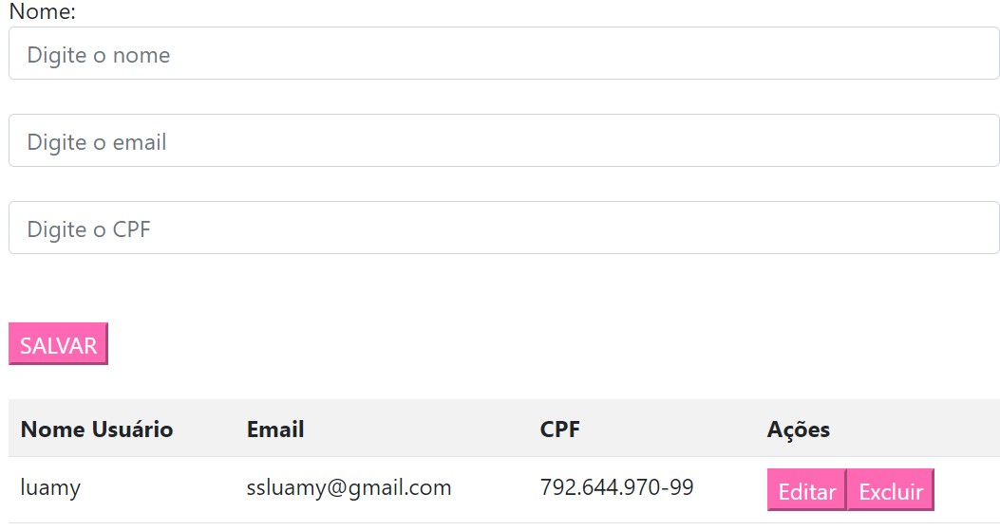

# 💌 Projeto de Login e Cadastro 💌

Bem-vindo ao meu projeto de Login e Cadastro! 🌟

Estou super empolgada para compartilhar essa atividade web que desenvolvi para facilitar o gerenciamento de logins e cadastros de usuários, incluindo validação de CPF e e-mail.

Com a ajuda do meu professor, conseguimos criar um sistema fácil de usar e bastante eficiente. A ideia foi construir uma interface simples e prática, onde você pode:

## 📝 Descrição

* **Registrar-se:** Adicione seu nome, e-mail e CPF à lista.
* **Fazer login:** Acesse a aplicação com seu e-mail e senha.
* **Validação do CPF:** Adicione seu CPF para garantir a complexidade dos dados.
* **Gerenciar dados:** Visualize todos os registros em uma lista organizada.
* **Excluir:** Remova nomes da lista quando não forem mais necessários.
* **Editar:** Altere informações na lista sem precisar excluir.

Além disso, incluí funcionalidades para adicionar novos nomes e editar informações existentes. Se precisar atualizar algum nome, você pode facilmente selecionar o item da lista e fazer as alterações necessárias.

## 🔑 Login

Permite que os usuários se autentiquem usando e-mail e senha. Após o login bem-sucedido, os usuários são redirecionados para a página de cadastro, onde podem começar a adicionar e gerenciar suas informações.

## 🗃️ Cadastro de Usuários

Os usuários podem registrar seu nome e visualizar todos os registros em uma lista organizada. A página de cadastro é projetada para ser fácil de usar, com campos claros e um botão de salvar acessível.

## 📋 Gerenciamento de Dados

A lista de registros permite que os usuários visualizem todos os nomes cadastrados. A interface proporciona uma maneira prática de adicionar novos registros e editar informações existentes.

## ✏️ Edição de Nomes

A funcionalidade de edição é particularmente útil para atualizar ou corrigir nomes já cadastrados. Os usuários podem selecionar um nome da lista e fazer alterações conforme necessário, garantindo que todas as informações estejam sempre corretas e atualizadas.

## ❌ Exclusão de Nomes

Permite remover nomes da lista em caso de erro ou quando um nome não pertence mais à lista.

## 💡 Funcionalidades Adicionais

* **Validação de Campos:** Implementamos validações básicas para garantir que os campos de e-mail, senha e CPF estejam corretamente preenchidos antes do envio dos formulários. ✅
* **Validação de CPF:** Função para validar o CPF, alertando o usuário caso o CPF seja inválido. 📋
* **Armazenamento Dinâmico:** Utilizamos JavaScript para atualizar dinamicamente a lista de nomes cadastrados, permitindo que os dados sejam exibidos e editados sem a necessidade de recarregar a página. 🔄

## 🧩 Tecnologias Utilizadas

* **HTML:** Utilizado para criar a estrutura das páginas de login e cadastro.
* **JavaScript:** Empregado para a lógica de autenticação, validação de formulários e gerenciamento de dados.

## 🎉 Visualizações do Projeto

* **Tela de Login:** 🌟

* **Tela de Cadastro:** 🌟

## 🔗 Conecte-se

Este projeto será documentado no LinkedIn para compartilhar meu trabalho. ❤️

## 📝 Autoria

Este projeto é uma criação de **Luamy Alves Gama**. Obrigada pela Atenção!
