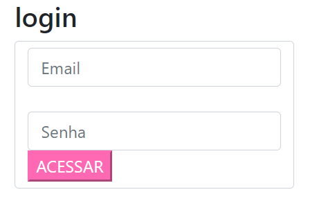
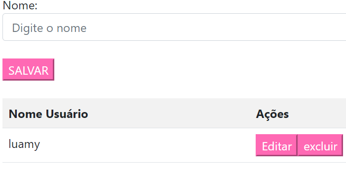

# 💌 Projeto de Login e Cadastro 💌

## Bem-vindo ao meu projeto de Login e Cadastro! 🌟

 Estou super empolgada para compartilhar essa atividade web que desenvolvi para facilitar o gerenciamento de logins e cadastros de usuários.

Com a ajuda do meu professor, conseguimos criar um sistema fácil de usar e bastante eficiente. A ideia foi construir uma interface simples e prática, onde você pode:

## 📝 Descrição

* Se registrar: Adicione seu nome e informações pessoais à lista.

* Fazer login: Acesse a aplicação com seu e-mail e senha.

* Gerenciar seus dados: Veja todos os nomes cadastrados em uma lista organizada.

* Excluir: função de excluir o nome da lista.

* Além disso, incluí funcionalidades para adicionar novos nomes à lista e editar informações existentes. Se precisar atualizar algum nome, você pode facilmente selecionar o item da lista e fazer as alterações necessárias.

## 🔑 Login

Permite que os usuários se autentiquem usando e-mail e senha. Após o login bem-sucedido, os usuários são redirecionados para a página de cadastro, onde podem começar a adicionar e gerenciar suas informações.

## 🗃️ Cadastro de Usuários

Os usuários podem registrar seu nome e visualizar todos os registros em uma lista organizada. A página de cadastro é projetada para ser fácil de usar, com campos claros e um botão de salvar acessível.

## 📋 Gerenciamento de Dados

A lista de registros permite que os usuários visualizem todos os nomes cadastrados. A interface proporciona uma maneira prática de adicionar novos registros e editar informações existentes.

## ✏️ Edição de Nomes

A funcionalidade de edição é particularmente útil para atualizar ou corrigir nomes já cadastrados. Os usuários podem selecionar um nome da lista e fazer alterações conforme necessário, garantindo que todas as informações estejam sempre corretas e atualizadas.

## ❌ Excluir nomes.

excluir nomes citado na lista caso houver algum erro, ou nome que nao pertece mais a lista.

## 💡 Funcionalidades Adicionais

* Validação de Campos: Implementamos validações básicas para garantir que os campos de e-mail e senha estejam corretamente preenchidos antes do envio dos formulários. ✅

* Armazenamento Dinâmico: Utilizamos JavaScript para atualizar dinamicamente a lista de nomes cadastrados, permitindo que os dados sejam exibidos e editados sem a necessidade de recarregar a página. 🔄

## 🧩 Linguagens ultilizadas

> HTML: Utilizado para criar a estrutura das páginas de login e cadastro. 

> JavaScript: Empregado para a lógica de autenticação, validação de formulários e gerenciamento de dados. 

# ❤️ veja a ilustração do meu projeto!

* Login! 🌟

* Cadastro! 🌟

# 🎉 linkedin

Este projeto será documentado no LinkedIn para compartilhar meu trabalho ❤️.

# *📝 Autoria:*

Este projeto é uma criação 'Luamy Alves Gama' Obrigada pela Atenção!!!